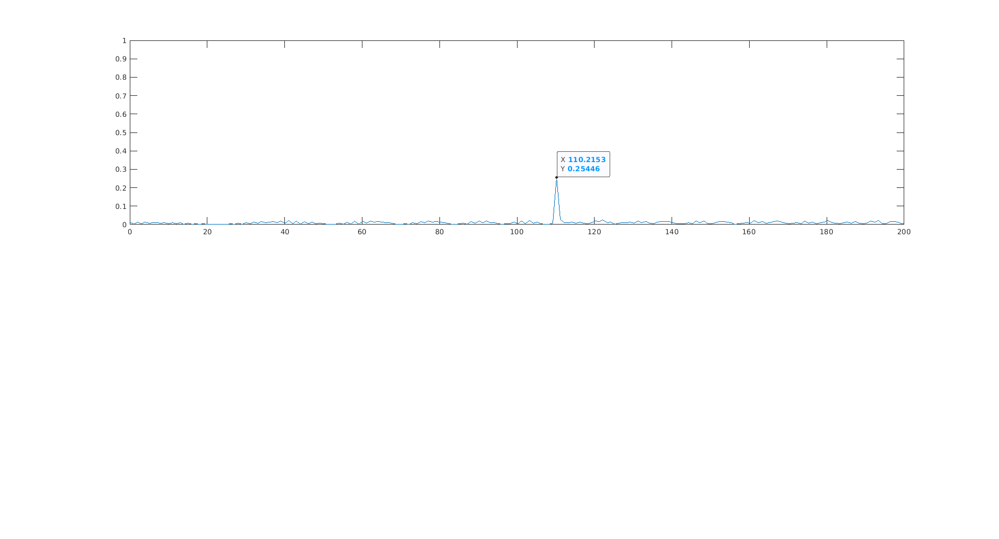
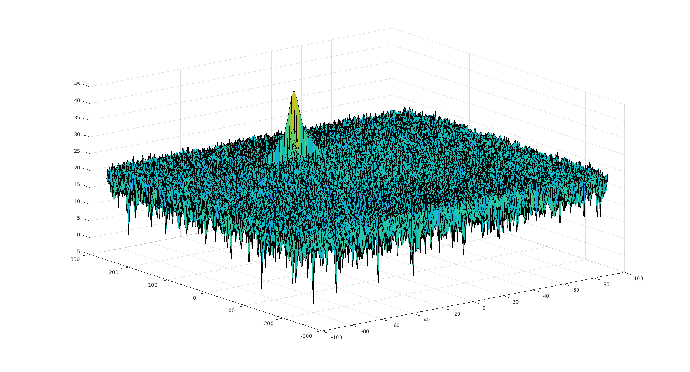
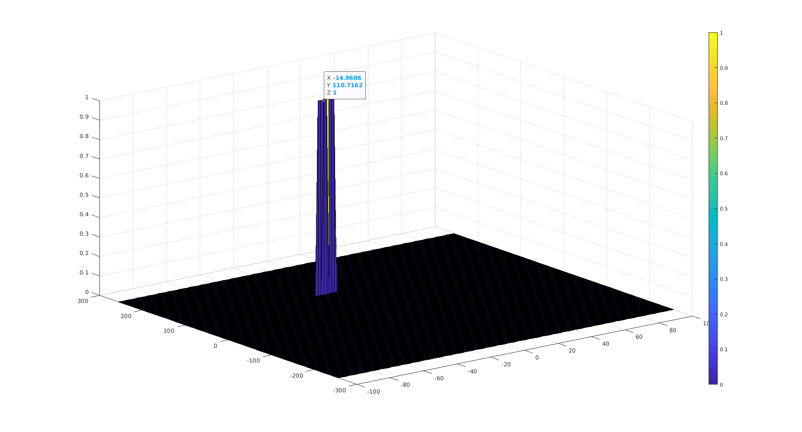
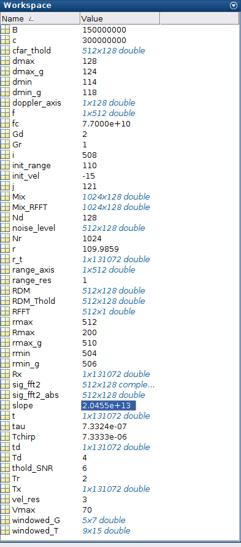

# RADAR Target Generation and Detection
As part of this project ,using matlab, a simulated signal to create a target with a range and range rate. Using 1D FFT and 2D FFT methods Range and Range Rate information was extracted from the simulated signal. CFAR threshold was also implemnted to filter out the noise. Following sections detail the process. 

## Implementation steps for the 2D CFAR process. 
To calculate 2D CFAR from 2D FFT output following steps were followed. I have used 2D FFT output directly (i.e. before it was converted to db).
- Loop through the 2D FFT output in range and doppler axis from 1 to "Nr/2-Tr-Gr-1" and 1 to "Nd-Td-Gd-1" respectively.
- Then create a window to select the cells for calculating the CFAR. 
          - Calculate the sum of cell in limits , this caculation includes gaurd and LUT cell
                           range axis :  i-Tr-Gr-1 to i+Tr+Gr+1
                           doppler axis :  j-Td-Gd-1 to j+Td+Gd+1
            ensure that the above limits are with in 1 to Nr/2 , 1 to ND limits , if they exceed trucate the size
            
          - Remove the gaurd and LUT cell from above sum, calculated the sum of cells that fall in 
                           range axis :  i-Gr-1 to i+Gr+1
                           doppler axis :  j-Gd-1 to j+Gd+1
          - Calculate the average of the resultant substraction.
 - Above step provides the noise level value in decimal , convert it to db using pow2db. 
 - Add SNR Offset to arrive at CFAR. 
 
 ## Selection of Training, Guard cells and offset
 - Training and Guard cells were arrived at by trial and error. I was aiming at less noise in the final output. Following combination worked for me. 
  Training cells:  Tr = 2 , Td = 4;
  Gaurd Cells: Gr = 1 ,Gd = 2;
- Offset: After arriving at right combination for traning and gaurd cells i saw small noise around the edges, i have increased the offset untill that noise is removed. 

 ## Steps taken to suppress the non-thresholded cells at the edges.
 Because of the method i followed for calculating CFAR i did not have any cells that were not thresholded. However i still saw peaks on the edges, CFAR threshold on the edge was low as i assumed 0's for the cells outside the matrix limits. Ideal situation could have been to use the cells from other end of the matrix i.e if i want to get value of cell(0,0) i should have taken values from cell(Nr/2,Nd). To suppress these peaks i have filled zeros, in the fill result ,in rows and columns on the edge. 
 
 ## Output:
 Following are snapshots of FFT and thresholded outputs. 
 
 1D FFT Output:
   
 2D FFT Output:
     
 CFAR Thersholded FFT Output:
     
   
 Slope: 
 
     
 
 
 

       
